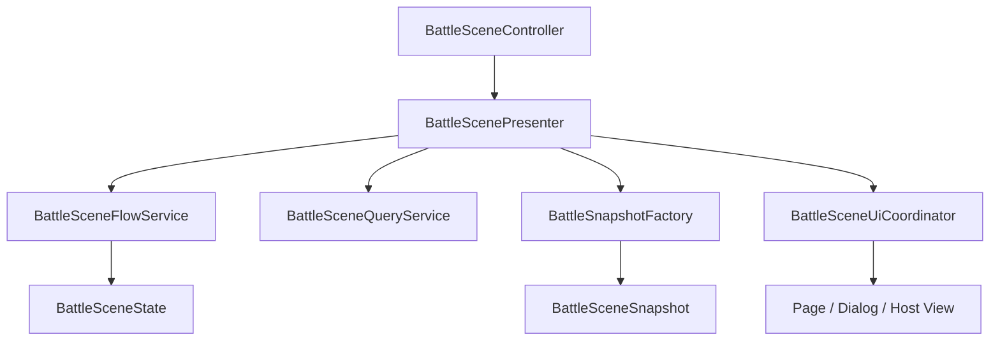

# Battle Architecture

## 概要

Battle モジュールは、進行制御、表示用データの組み立て、UI 遷移を分離して構成しています。  
1 つのクラスに進行、表示、ダイアログ管理を集めず、それぞれの責務を明確に保つことが重要です。

## この機能の責務

- Battle 関連クラスの役割分担を説明する
- どのクラスを起点に読むと理解しやすいかを示す
- 修正箇所の当たりをつけやすくする

## 関連クラス / 関連ディレクトリ

- `BattleSceneController`
- `BattleScenePresenter`
- `BattleSceneUiCoordinator`
- `BattleSceneFlowService`
- `BattleSceneQueryService`
- `BattleSnapshotFactory`
- `BattleSceneLifetimeScope`

## 役割分担

| クラス | 役割 |
|---|---|
| `BattleSceneController` | シーン入口。View と Presenter の接続開始 |
| `BattleScenePresenter` | FlowService の状態を読み、UI 表示と操作結果をつなぐ |
| `BattleSceneUiCoordinator` | Map / Dialog / Battle base の切り替えを担当する |
| `BattleSceneFlowService` | 戦闘と run 進行の中心ロジック |
| `BattleSceneQueryService` | 読取専用インターフェース。snapshot やカード選択状態の取得 |
| `BattleSnapshotFactory` | `BattleSceneState` から UI 用 snapshot を組み立てる |
| `BattleSceneLifetimeScope` | Battle シーンの依存登録 |

## データやイベントの流れ

## 読み方の目安

- シーン起動時の流れを知りたい場合
  `BattleSceneController` → `BattleScenePresenter.InitializeAsync`
- 戦闘や報酬の進行を知りたい場合
  `BattleSceneFlowService`
- 表示内容の作られ方を知りたい場合
  `BattleSnapshotFactory` → `BattleDisplayViewModels`
- どのダイアログがどこで開くか知りたい場合
  `BattleSceneUiCoordinator`

## サブサービス構造

`BattleSceneFlowService` の責務は以下のサブサービスへ分割されている。

| サブサービス | 責務 |
|---|---|
| `IBattleRewardFlowService` | 報酬画面の表示・選択・claim フロー |
| `IBattleRestShopFlowService` | 休憩・ショップ・強化・カード削除のフロー |
| `IBattleEventFlowService` | イベント画面の表示・選択肢決定フロー |
| `IBattleCheckpointService` | セーブデータ構築・リストア |
| `IBattleDeckService` | 山札・手札・捨て札・廃棄札の操作 |
| `IBattleEnemyActionSelector` | 敵行動選択・ターゲット補正・選択敵取得 |
| `IBattleCombatResolver` | カード使用・敵ターン解決・ダメージ計算 |
| `IBattleEncounterSelector` | 遭遇フォーメーション抽選 |
| `IBattleRewardRollService` | 報酬カード抽選 |

## BattleSceneState の集中化メソッド

複数の Service に散在していた「まとめて更新しなければならないフィールド群」の操作を、`BattleSceneState` 自身のメソッドとして集約している。

| メソッド | 対象操作 |
|---|---|
| `ClearOwnedInspections()` | 所持レリック・ポーション選択状態の一括クリア |
| `ClearPendingRewards()` | PendingRelicReward / PendingPotionReward / PendingPotionOffer の一括リセット |
| `PrepareForNewBattle()` | 戦闘開始時の戦闘関連状態の初期化 (BattleFinished, Energy, Block, Enemy など) |
| `CanMoveToNode(int)` | ノード遷移可否の判定 |
| `SyncSelectedEnemyDisplay(…)` | 選択敵の旧表示項目の同期 |

また、フィールドは `#region` で Card / Owned items / Reward / Map / Battle / Inventory / RestShop / Event / Page の単位に分類されている。

## インターフェース分割

- `IBattleSceneQueryService` は読取専用の 6 メソッド（`CreateSnapshot` / `GetCardSelect*`）を提供する
- `IBattleSceneFlowService` は `IBattleSceneQueryService` を継承している
- Presenter は `IBattleSceneQueryService` と `IBattleSceneFlowService` の両方を注入する

## 重複ロジックの整理

以前は `BattleSceneFlowService` と `BattleSnapshotFactory` に同一実装の private メソッドが存在していたが、本体の居場所へ一元化した。

| 整理対象 | 移動先 |
|---|---|
| `GetSelectedEnemy()`（各クラスの private 版） | `IBattleEnemyActionSelector.GetSelectedEnemy()` |
| `CanMoveToNode()`（各クラスの private 版） | `BattleSceneState.CanMoveToNode()` |
| `CopyDictionary()`（FlowService の使用されていない private 版） | 削除 |

## 変更時の注意点

- UI の表示都合で `BattleSceneFlowService` に View 依存を入れない
- ダイアログ追加時は Coordinator 経由のルートを増やし、Presenter から直接 `IUIService` を触らない
- snapshot の項目を増やす場合は、まず `BattleSceneState` と `BattleSnapshotFactory` の責務を見直す
- 新たな Service を作ったときは、`BattleSceneLifetimeScope` への登録が必要
- 複数フィールドの一括更新は `BattleSceneState` のメソッドに集約し、各 Service で生フィールド代入を書かない
- Presenter への読取追加は `IBattleSceneQueryService` に、書込追加は `IBattleSceneFlowService` に
