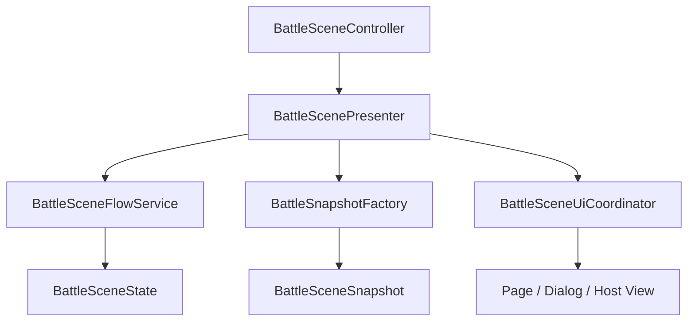

# Battle Architecture

## 概要

Battle モジュールは、進行制御、表示用データの組み立て、UI 遷移を分離して構成しています。  
1 つのクラスに進行、表示、ダイアログ管理を集めず、それぞれの責務を明確に保つことが重要です。

## この機能の責務

- Battle 関連クラスの役割分担を説明する
- どのクラスを起点に読むと理解しやすいかを示す
- 修正箇所の当たりをつけやすくする

## 関連クラス / 関連ディレクトリ

- `BattleSceneController`
- `BattleScenePresenter`
- `BattleSceneUiCoordinator`
- `BattleSceneFlowService`
- `BattleSnapshotFactory`
- `BattleSceneLifetimeScope`

## 役割分担

| クラス | 役割 |
|---|---|
| `BattleSceneController` | シーン入口。View と Presenter の接続開始 |
| `BattleScenePresenter` | FlowService の状態を読み、UI 表示と操作結果をつなぐ |
| `BattleSceneUiCoordinator` | Map / Dialog / Battle base の切り替えを担当する |
| `BattleSceneFlowService` | 戦闘と run 進行の中心ロジック |
| `BattleSnapshotFactory` | `BattleSceneState` から UI 用 snapshot を組み立てる |
| `BattleSceneLifetimeScope` | Battle シーンの依存登録 |

## データやイベントの流れ

## 読み方の目安

- シーン起動時の流れを知りたい場合
  `BattleSceneController` → `BattleScenePresenter.InitializeAsync`
- 戦闘や報酬の進行を知りたい場合
  `BattleSceneFlowService`
- 表示内容の作られ方を知りたい場合
  `BattleSnapshotFactory` → `BattleDisplayViewModels`
- どのダイアログがどこで開くか知りたい場合
  `BattleSceneUiCoordinator`

## 変更時の注意点

- UI の表示都合で `BattleSceneFlowService` に View 依存を入れない
- ダイアログ追加時は Coordinator 経由のルートを増やし、Presenter から直接 `IUIService` を触らない
- snapshot の項目を増やす場合は、まず `BattleSceneState` と `BattleSnapshotFactory` の責務を見直す
