# Battle Data Flow

## 概要

Battle では、MasterData の生データをそのまま UI に流していません。  
まず runtime DTO に変換し、その後 `BattleSceneState` から page / dialog ごとの section を持つ `BattleSceneSnapshot` を組み立てて表示へ渡しています。

## この機能の責務

- MasterData から UI までの流れを説明する
- runtime DTO と snapshot の違いを整理する
- 変更時にどの層を直すべきか判断しやすくする

## 関連クラス / 関連ディレクトリ

- `BattleMasterDataFacade`
- `EventMasterDataFacade`
- `ShopMasterDataFacade`
- `BattleRuntimeDefinitions`
- `BattleSceneState`
- `BattleSceneSnapshot`
- `BattleSceneSnapshotBuilder`
- `BattleSnapshotFactory`

## データの段階

| 段階 | 主な型 | 用途 |
|---|---|---|
| MasterData | `*Master`, `*.generated.cs` | CSV / generator 由来の元データ |
| runtime DTO | `RuntimeCard`, `RuntimeEnemy`, `RuntimeRunDefinition` など | ゲームロジックで使う安定した型 |
| state | `BattleSceneState` | 実行中の可変状態 |
| snapshot | `BattleSceneSnapshot` + 各 section snapshot | UI へ渡す読み取り用状態 |
| view model | `BattleMultiIconViewModel` など | 表示部品に近いデータ |

## データやイベントの流れ

```mermaid
flowchart LR
    MasterData["Generated MasterData"] --> Facade["BattleMasterDataFacade"]
    Facade --> Runtime["Runtime DTO"]
    Runtime --> Flow["BattleSceneFlowService"]
    Flow --> State["BattleSceneState"]
    State --> SnapshotFactory["BattleSnapshotFactory"]
    SnapshotFactory --> SectionBuilders["Section builder methods"]
    SectionBuilders --> SnapshotBuilder["BattleSceneSnapshotBuilder"]
    SnapshotBuilder --> Snapshot["BattleSceneSnapshot"]
    Snapshot --> Params["Page / Dialog Param"]
    Params --> UI["Presenter / View / Dialog"]
```

## 変更時の注意点

- MasterData 追加だけで UI が変わるわけではない
- 新しい項目がロジック用か表示用かを先に決める
- runtime DTO に追加した情報を UI で使うなら、`BattleSnapshotFactory` の該当 section と page / dialog param まで反映する
