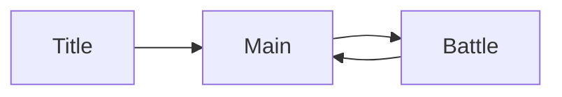

# Project Overview

## 概要

Vox Dungeon は、Unity 6000 系で開発している roguelike 系のカード構築ゲームです。  
戦闘の中核は `Battle` モジュールに集約されており、DI、非同期、Reactive、MasterData 生成を組み合わせて構成しています。

## この機能の責務

- プロジェクト全体の技術的な前提を共有する
- 主要シーンと主要アセンブリの関係を示す
- Battle 以外の周辺モジュールの位置づけを説明する

## 関連クラス / 関連ディレクトリ

- `DungeonUnity/Assets/Scripts/Runtime/OutGame/Title/`
- `DungeonUnity/Assets/Scripts/Runtime/OutGame/Main/`
- `DungeonUnity/Assets/Scripts/Runtime/InGame/Battle/`
- `DungeonUnity/Assets/Scripts/Runtime/InGame/Save/`
- `DungeonUnity/Assets/Scripts/Runtime/SceneFlow/`

## 技術スタック

- DI: `VContainer`
- 非同期: `UniTask`
- 通知とイベント: `R3`
- UI / Scene / Localization 基盤: `TFramework`
- データ供給: `Generated/MasterData`

## シーン構成

## asmdef の大枠

- `Dungeon.Runtime.InGame.Battle`
  Battle の進行、表示、UI、runtime DTO
- `Dungeon.Runtime.InGame.Save`
  RunSaveData と保存サービス
- `Dungeon.Runtime.SceneFlow`
  シーン間の bridge data
- `Dungeon.Runtime.OutGame.Main`
  Run 開始と Continue 導線
- `Game.MasterData.Generated`
  生成済み MasterData 型

## データやイベントの流れ

- Main で Run を開始すると `BattleRunBridgeData` が設定される
- Battle で `RunProfileId` を受け取り、MasterData から runtime 定義を組み立てる
- 戦闘進行は `BattleSceneFlowService` が持ち、UI は snapshot 経由で表示する
- Save が存在する場合は `RunSaveService` から復元する

## 変更時の注意点

- Battle のロジックを View へ直接置かない
- Save / SceneFlow / Battle の境界をまたぐ変更は、関係ページをまとめて読む
- MasterData に新項目を追加したら、runtime facade 側の変換も必ず確認する
