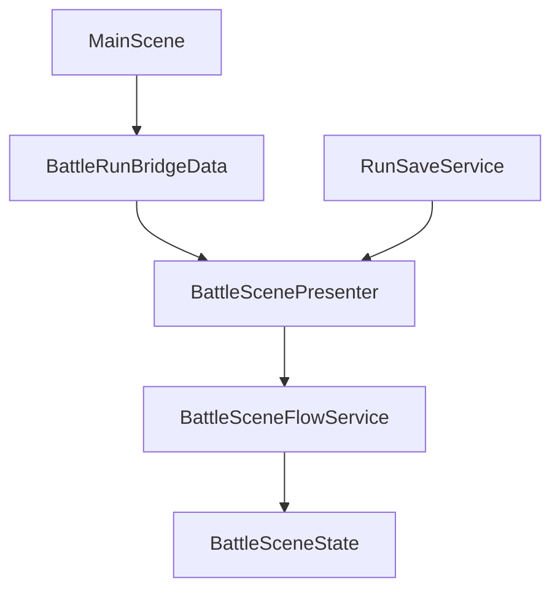

# Save and SceneFlow

## 概要

Battle は単独で始まるのではなく、Main からの開始情報と保存済み Run の両方を扱います。  
そのため、SceneFlow と Save は Battle の外側にある重要な入口です。

## この機能の責務

- Battle へ入る前後のデータ受け渡しを整理する
- 新規開始と再開の違いを説明する
- Save 周りの変更時に確認すべき箇所を明確にする

## 関連クラス / 関連ディレクトリ

- `BattleRunBridgeData`
- `BattleRunProfileResolver`
- `RunSaveData`
- `IRunSaveService`
- `RunSaveService`
- `MainSceneController`
- `BattleScenePresenter`
- `BattleSceneFlowService`

## 新規開始と再開

| ケース | 起点 | Battle 側の入口 |
|---|---|---|
| 新規開始 | Main | `runProfileId` を使って初期化 |
| 再開 | Save | `RunSaveData` を使って復元 |

## データやイベントの流れ

## 処理の考え方

- SceneFlow は「どの RunProfile で Battle を始めるか」を渡す
- Save は「途中状態をどう復元するか」を渡す
- Presenter は Save が有効なら復元を優先し、無効なら新規初期化へ進む

## 変更時の注意点

- Battle の state を増やしたら `RunSaveData` と復元処理を確認する
- Main 側で Run 開始条件を変えたら `BattleRunBridgeData` の受け渡しも確認する
- Save と UI を同時に変える場合は、再開直後の snapshot が正しいかを必ず見る
